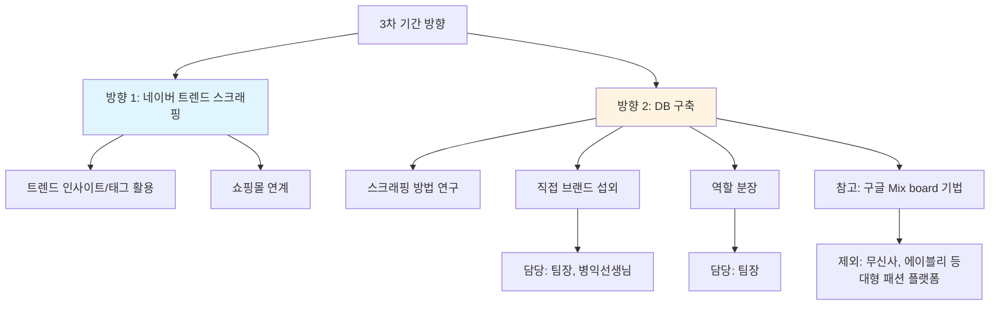
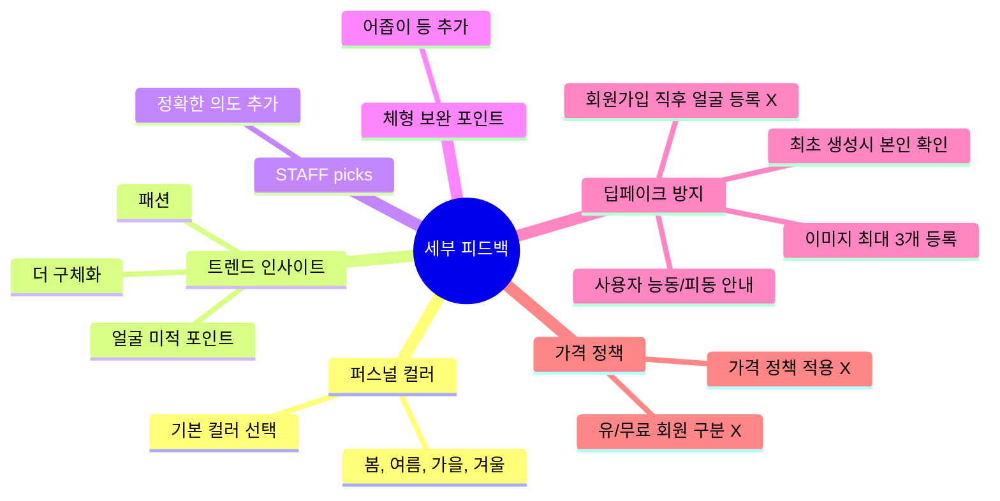
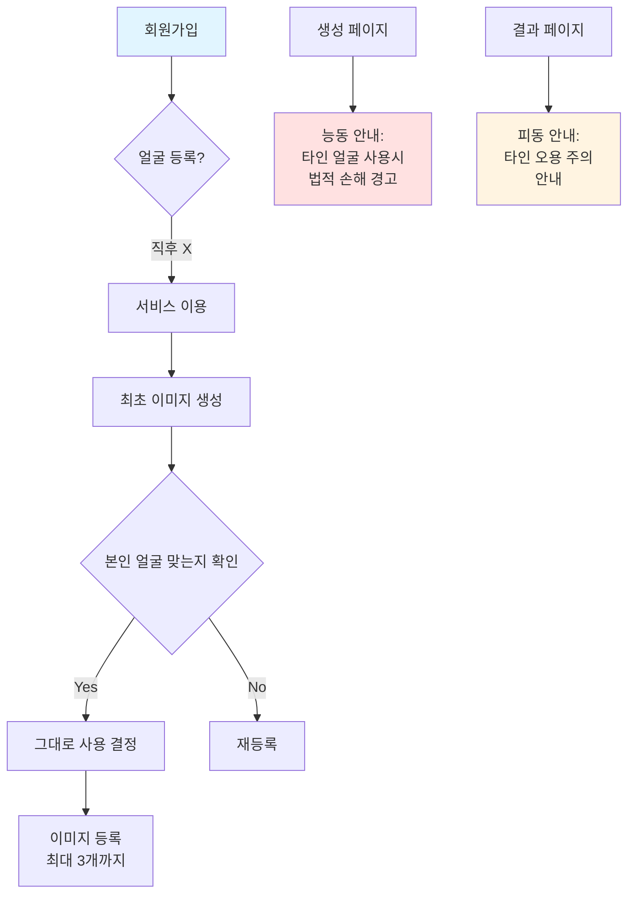
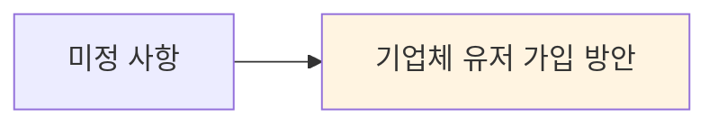
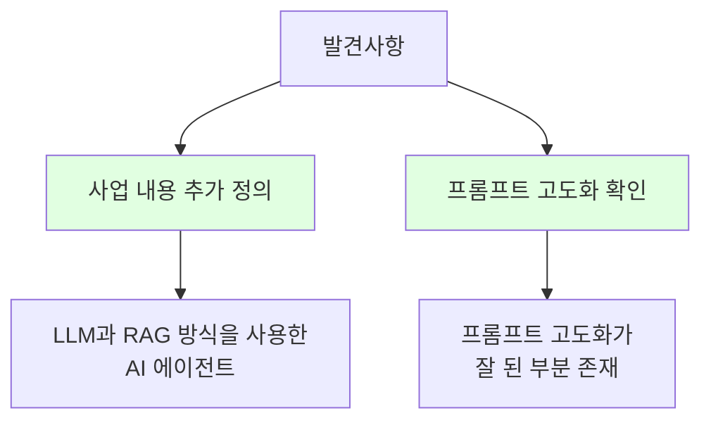
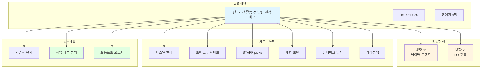

# 3차 기간 활동 전 방향 선정 회의_251230(화)

## 회의 정보
- **시간**: 16:15~17:30
- **참여자(6)**: 김찬호, 오채언, 정환석, 정한솔, 황병익, 정근선

## 주요내용
3차 활동 방향 선정 및 기존 내용에 대한 상세피드백

---

## 3차 기간 방향 선정

### 방향 1: 네이버 트렌드 스크래핑 통해 쇼핑몰 연결
- 이미지와 같이 나오는 Trend Insight/Tag 내용 잘 활용해 쇼핑몰 연계해보기

### 방향 2: DB 구축 통한 DB속 데이터로 쇼핑몰 연결
- 스크래핑(크롤링) 구체적인 방법 연구 및 역할 분장 예정
- 직접 브랜드 섭외 문의 (☞ 팀장, 병익선생님)
- 업무 규모에 따른 역할 분장 예정 (☞ 팀장)
- **참고**: 구글 Mix board 기법
- **제외**: 이미 구축된 대형 패션 플랫폼들 (ex. 무신사, 에이블리 등)
- **참고 아이디어**: 2번 노드의 코끼리DB 위치 이동으로 1번 노드에 붙이는 방법 (by 한솔님)

---

## 세부 피드백

### 1. 퍼스널 컬러
- 봄, 여름, 가을, 겨울 등 기본 컬러 선택하게끔

### 2. 트렌드 인사이트
- 패션 + (얼굴)미적 포인트 등 더 구체화

### 3. STAFF picks
- 정확한 의도 추가

### 4. 체형 보완 포인트 추가
- 어좁이 등

### 5. 딥페이크 방지 방안

**상세 내용:**
- 회원가입 직후 얼굴 등록 X
- 최초 생성시 본인 자신 맞는지 확인 후 그대로 쓸지 결정
- 자기 얼굴 이미지 등록시 최대 3개까지 등록 가능
- **사용자 능동 입장 안내** (생성 페이지):
  - "자기 외에 타인의 얼굴을 사용하면 법적 손해에 처할 수 있습니다"
- **사용자 피동 입장 안내** (결과 페이지):
  - "자신의 얼굴을 타인이 오용할 수 있으니 사용에 주의 바랍니다"

### 6. 유/무료 회원 구분
- 적용 안 함 (X)

### 7. 가격 정책 적용
- 적용 안 함 (X)

---

## 미정 사항 (향후 사업 전략)

### 1. 기업체 유저가 가입하게끔
- 향후 사업 전략으로 검토 예정

---

## 발견사항

### 1. 사업 내용 추가 정의
- "LLM과 RAG 방식을 사용한 AI 에이전트"

### 2. 프롬프트의 고도화
- 프롬프트의 고도화가 잘 된 부분 존재했음

---

## 전체 구조도

